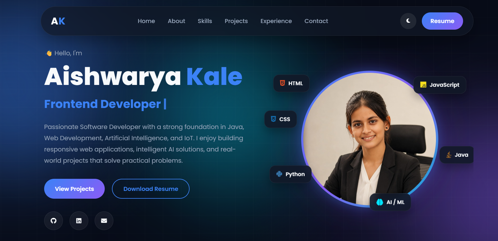

<h1 align="center">
  👋 Hi, I'm <span style="color:#3B82F6;">Aishwarya Kale</span>
</h1>

<h3 align="center">
💻 Software Developer • ☕ Java Developer • 🤖 AI & ML Enthusiast
</h3>

<p align="center">
Building modern web applications, intelligent AI solutions, and scalable software with a passion for clean design and great user experiences.
</p>

<p align="center">
<a href="https://my-portfolio-five-rho-64.vercel.app">

</a>

<a href="YOUR_LINKEDIN_URL">

</a>

<a href="https://github.com/Aish1506-k">

</a>

</p>

<p align="center">


</p>

---

<div align="center">

### 🚀 Turning ideas into responsive web applications and AI-powered solutions

</div>


# 📸 Portfolio Preview

<p align="center">



</p>

---

# 🚀 Live Demo

### 🔗 https://my-portfolio-five-rho-64.vercel.app

---

# ✨ Features

- 🌙 Dark & Light Theme
- 📱 Fully Responsive Design
- 🎨 Modern Glassmorphism UI
- ✨ Smooth Animations
- 💻 Interactive Hero Section
- 🧩 Floating Tech Stack Cards
- 👩‍💻 About Me Section
- 🚀 Skills Showcase
- 📂 Featured Projects
- 🎓 Education Timeline
- 📞 Contact Section
- 📄 Resume Download
- ⚡ Optimized Performance

---

# 🛠 Tech Stack

## Frontend

- HTML5
- CSS3
- JavaScript (ES6)

## Design

- CSS Grid
- CSS Flexbox
- Glassmorphism
- CSS Animations
- Responsive Web Design

## Deployment

- GitHub
- Vercel

---

# 📂 Project Structure

```text
MyPortfolio
│
├── assets
│   ├── images
│   │   └── portfolio-preview.png
│   ├── icons
│   └── resume.pdf
│
├── css
│   ├── style.css
│   ├── navbar.css
│   ├── hero.css
│   ├── about.css
│   ├── skills.css
│   ├── projects.css
│   ├── experience.css
│   ├── contact.css
│   ├── footer.css
│   ├── animations.css
│   └── responsive.css
│
├── js
│   ├── script.js
│   ├── theme.js
│   ├── typing.js
│   └── scroll.js
│
├── index.html
└── README.md
```

---

# 💼 Featured Projects

## 🧠 Explainable Brain Tumor Detection

An AI-powered web application that detects and classifies brain tumors from MRI images using Deep Learning and Explainable AI techniques.

**Tech Stack**

- Python
- TensorFlow
- OpenCV
- Streamlit
- Grad-CAM

---

## 💡 Automatic Street Light Control

An IoT-based smart street lighting system using ESP32 with PIR, LDR, and Sound Sensors for intelligent automation.

**Tech Stack**

- ESP32
- Arduino IDE
- HTML
- CSS
- JavaScript

---

## 🍔 Online Food Delivery System

A Java desktop application that manages food ordering, payment processing, customer records, and delivery tracking.

**Tech Stack**

- Java
- JDBC
- MySQL

---

## 🎮 Tic Tac Toe Game

A responsive Tic Tac Toe game built using HTML, CSS, and JavaScript.

---

# 📱 Responsive Design

This portfolio is optimized for:

- 📱 Mobile Devices
- 📱 Tablets
- 💻 Laptops
- 🖥 Desktop Screens

---

### Clone the Repository

```bash
git clone https://github.com/Aish1506-k/MyPortfolio.git
```

### Navigate to the Project Folder

```bash
cd MyPortfolio
```

### Open the Website

Open `index.html` directly in your browser

**OR**

Run the project using **VS Code Live Server**:

1. Open the project in Visual Studio Code.
2. Install the **Live Server** extension (if not already installed).
3. Right-click on `index.html`.
4. Click **Open with Live Server**.


# 📬 Connect With Me

📧 **Email**

aishwaryakale697@gmail.com

💼 **LinkedIn**

www.linkedin.com/in/aishwarya-kale-367510297

💻 **GitHub**

https://github.com/Aish1506-k


🌐 **Portfolio**

https://my-portfolio-five-rho-64.vercel.app

---

# ⭐ Support

If you like this project, please consider giving it a ⭐ on GitHub. It helps support my work and encourages future improvements.

---


<p align="center">

Made with ❤️ by <strong>Aishwarya Kale</strong>

</p>
